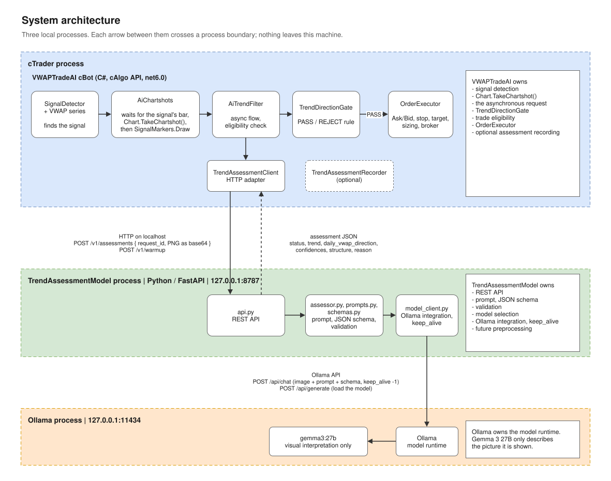
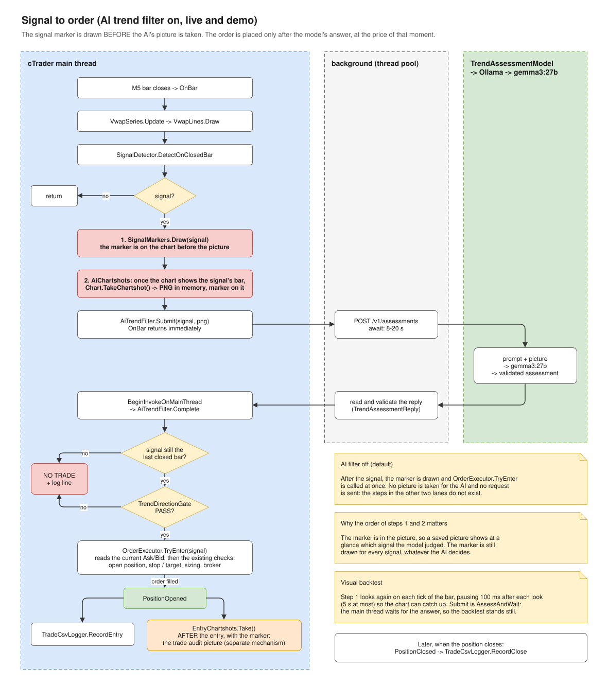
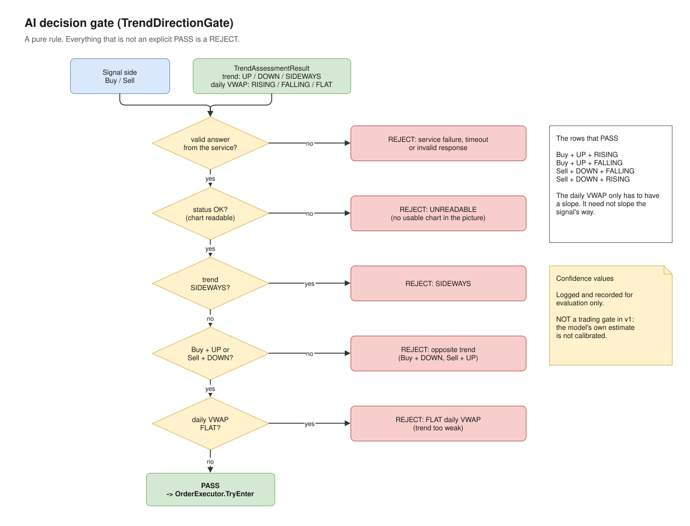
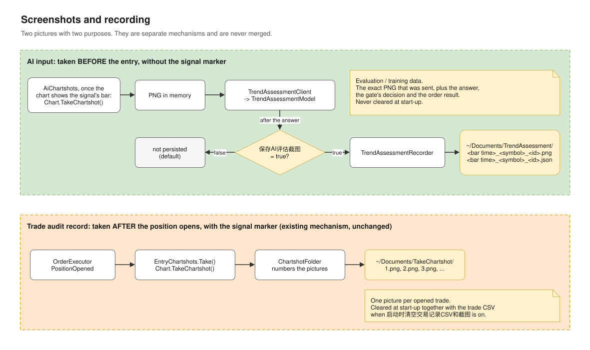
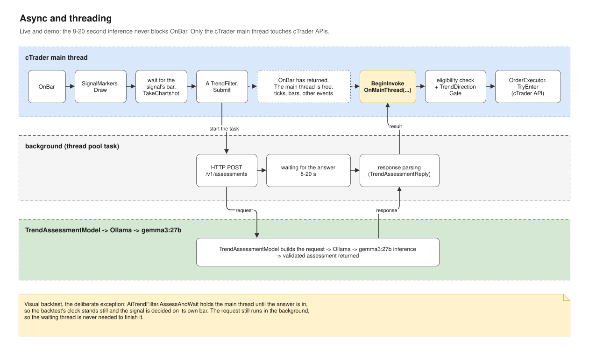
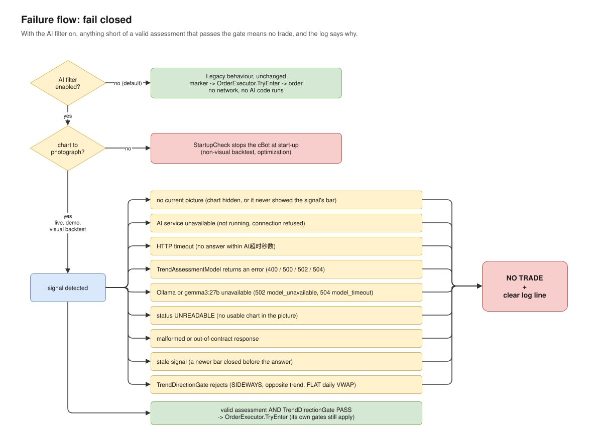

# Architecture

This document describes the optional **AI trend filter** as it is implemented: which process does
what, the order of events from a signal to an order, the decision rule, the threading model and the
HTTP contract between the two projects. The strategy itself (VWAP, signals, sizing) is described in
[CLAUDE.md](../CLAUDE.md).

The diagrams are pages of one editable draw.io file, [architecture.drawio](architecture.drawio),
which is the source of truth. The SVG files beside it are exports of those pages. See
[Editing the diagrams](#editing-the-diagrams).

## Purpose

VWAPTradeAI finds VWAP Strong signals and trades them. The AI trend filter adds one optional
question between the signal and the order:

> Does the chart, as it looks right now, support this signal's direction?

A local vision model answers it from a screenshot. The model is not asked to find signals, predict
prices, size a position, set a stop or target, or place an order; all of that stays where it was.

The filter is **off by default**. With it off, the cBot runs exactly as it did before the filter
existed: no screenshot for the AI, no network request, no AI code on the trading path.

## System overview



Three processes on one machine. Nothing leaves it.

```text
cTrader process            VWAPTradeAI cBot (C#)
      │  HTTP on localhost: PNG + request_id
      ▼
TrendAssessmentModel       Python / FastAPI     http://127.0.0.1:8787
      │  Ollama API
      ▼
Ollama                     model runtime        http://127.0.0.1:11434
      │
      ▼
gemma3:27b                 looks at the picture
```

## Component responsibilities

### VWAPTradeAI (this repository)

Owns trading, and the decision whether to trade.

| What | Where |
| --- | --- |
| Signal detection | `Signals/SignalDetector.cs` (unchanged by the filter) |
| Taking the AI's picture once the chart shows the signal's bar, with its marker | `Chartshots/AiChartshots.cs` through `IChartCamera` (`Chart.TakeChartshot()`) |
| The asynchronous request and its return to the cBot thread | `TrendAssessment/AiTrendFilter.cs` |
| Trade eligibility (the signal is still the last closed bar) | `TrendAssessment/AiTrendFilter.cs` |
| The PASS / REJECT rule | `TrendAssessment/TrendDirectionGate.cs` |
| The service's HTTP contract | `TrendAssessment/TrendAssessmentClient.cs`, `TrendAssessmentReply.cs` |
| Entry price, stop, target, sizing, broker | `Orders/OrderExecutor.cs`, `Orders/OrderPlanner.cs` (unchanged) |
| Optional recording of the AI's input and answer | `TrendAssessment/TrendAssessmentRecorder.cs` |
| Refusing the filter where it cannot work | `StartupCheck.FindAiFilterError` |

It never knows Ollama's API, the prompt, the JSON schema given to the model, `keep_alive` or how the
model's reply is parsed.

### TrendAssessmentModel (separate repository)

[github.com/richardgong1987/TrendAssessmentModel](https://github.com/richardgong1987/TrendAssessmentModel),
cloned to `~/PycharmProjects/TrendAssessmentModel`. Owns everything about the model:

- the REST API (`api.py`)
- the prompt and the JSON schema the model's reply is constrained to (`prompts.py`)
- validating the model's reply (`schemas.py`, `assessor.py`)
- which model is used, the Ollama integration and `keep_alive` (`model_client.py`, `config.py`)
- any future preprocessing of the picture

It knows nothing about signals, sides or orders: the request carries only a picture.

### Ollama

The model runtime, at `http://127.0.0.1:11434`. It loads the model, keeps it in memory and runs
the inference.

### Gemma 3 27B

`gemma3:27b`. Visual interpretation only: it describes the chart it is shown, as a trend and a
daily VWAP direction, or says the picture is not a usable chart.

## Runtime sequence



With the filter on, live or demo, for each closed M5 bar (`OnBar`):

1. `VwapSeries.Update` and `VwapLines.Draw`, as always. `AiChartshots.OnNewBar` settles a
   signal from the last bar whose picture never came (rejected, see below).
2. `SignalDetector.DetectOnClosedBar`. No signal: nothing else happens.
3. **`SignalMarkers.Draw(signal)`** draws the marker, in `OnBar`. It is drawn for every detected
   signal, whatever the AI later decides.
4. **`AiChartshots` takes the picture once the chart shows the signal's bar.** It checks
   `Chart.LastVisibleBarIndex`: the chart must show the bar after the signal's, so the signal's
   own bar is complete on screen. Live this is normally true at once, or on the next tick. If the
   chart still has not caught up after two ticks, it is scrolled to the newest bar once. Then
   **`Chart.TakeChartshot()`** returns the chart as PNG bytes, in memory, with the signal's marker
   on it. If the chart never shows the bar (a minute of market time, or the next bar opens),
   there is no picture and the signal is rejected (`AI chart not current`).
5. `AiTrendFilter.Submit(signal, png)` starts the request and returns, as does the handler
   (`OnBar`, or the `OnTick` on which the picture was taken).
6. On a thread-pool thread, `TrendAssessmentClient` posts the picture to
   `POST /v1/assessments` and waits. TrendAssessmentModel asks `gemma3:27b` through Ollama and
   returns a validated assessment. `TrendAssessmentReply` checks the reply again.
7. `BeginInvokeOnMainThread` brings the result back to the cBot thread, to
   `AiTrendFilter.Complete`.
8. **Eligibility:** the signal's bar must still be the last closed bar (`Bars.Count - 2`). If a
   newer bar has closed, the signal has expired.
9. **`TrendDirectionGate`** decides PASS or REJECT.
10. On PASS, `OrderExecutor.TryEnter(signal)` runs unchanged: it reads the **current** Ask/Bid and
    applies its own gates (open position, price still between stop and target, sizing, broker).
    No price is kept from before the wait.
11. If the order fills, `PositionOpened` fires and its existing observers run:
    `TradeCsvLogger.RecordEntry` and `EntryChartshots.Take()`. Later, `PositionClosed` runs
    `TradeCsvLogger.RecordClose`.

Steps 3 and 4 are in that order on purpose: the picture shows the signal's own marker, so a
saved picture shows at a glance which signal the model judged.

In a visual backtest the steps are the same with two differences. In step 4, each look that
finds the chart behind ends with a 100 ms pause, so the backtest slows down for that bar and the
chart catches up before the next tick; the wait ends after 50 pauses (5 s) instead of a minute of
market time. Step 5 is `AiTrendFilter.AssessAndWait`, which waits
for the answer instead of returning: steps 6 to 11 then happen before the handler returns, and
step 7 needs no hand-off because the cBot thread never left. See
[Backtest behavior](#backtest-behavior).

With the filter off, steps 4 to 9 do not exist: after step 3 `TryEnter` is called at once.

## AI decision rules



`TrendDirectionGate` is a pure function of the signal's side and the assessment.

| Signal | Trend | Daily VWAP | Decision |
| --- | --- | --- | --- |
| Buy | `UP` | `RISING` | PASS |
| Buy | `UP` | `FALLING` | PASS |
| Buy | `UP` | `FLAT` | REJECT |
| Sell | `DOWN` | `FALLING` | PASS |
| Sell | `DOWN` | `RISING` | PASS |
| Sell | `DOWN` | `FLAT` | REJECT |
| Buy | `DOWN` | any | REJECT (opposite trend) |
| Sell | `UP` | any | REJECT (opposite trend) |
| any | `SIDEWAYS` | any | REJECT |
| any | status `UNREADABLE` | | REJECT |
| any | service or model failure, timeout | | REJECT |
| any | invalid response | | REJECT |

The daily VWAP only has to have a slope; it does not have to slope the signal's way. A flat daily
VWAP means the trend is too weak for this strategy.

**Confidence is not part of the rule.** `confidence` and `daily_vwap_confidence` are the model's
own estimates and are not calibrated. They are logged and recorded for evaluation, and never used
as a threshold in v1.

## Screenshot lifecycle



Two different pictures are taken, for two different purposes, by two separate mechanisms.

| | AI input | Trade audit record |
| --- | --- | --- |
| Taken | Once the chart shows the signal's bar, after its marker is drawn | After a position opens (`PositionOpened`) |
| Signal marker on it | Yes | Yes |
| Code | `VWAPTradeAI.cs` → `AiTrendFilter` | `Chartshots/EntryChartshots.cs` → `ChartshotFolder` |
| Normally kept | No, in memory only | Yes |
| Folder | `~/Documents/TrendAssessment/` (only when recording is on) | `~/Documents/TakeChartshot/` |
| Cleared at start-up | Never | Yes, when `启动时清空交易记录CSV和截图` is on |

**Pre-AI screenshot.** PNG bytes from `Chart.TakeChartshot()`, taken by `AiChartshots` once the
chart shows the signal's bar, sent to the service and then dropped.

**Optional AI evaluation recording.** With `保存AI评估截图` on, `TrendAssessmentRecorder` writes two
files per assessment, named by the signal bar's time, the symbol and the first eight characters of
the request ID:

```text
~/Documents/TrendAssessment/20260930-220500_XAUUSD_7f3c2a9e.png    the exact bytes that were sent
~/Documents/TrendAssessment/20260930-220500_XAUUSD_7f3c2a9e.json
```

```json
{
  "request_id": "7f3c2a9e5d414b0fa1c6e2b8d4a90c13",
  "symbol": "XAUUSD",
  "signal_side": "Buy",
  "signal_label": "L_Pin_1",
  "signal_bar_time": "2026-09-30T22:05:00",
  "outcome": "OK",
  "trend": "UP",
  "confidence": 0.85,
  "daily_vwap_direction": "RISING",
  "daily_vwap_confidence": 0.9,
  "structure": "Uptrend with recent consolidation",
  "reason": "The price action shows generally higher highs and higher lows ...",
  "model": "gemma3:27b",
  "gate": "PASS",
  "gate_reject_reason": null,
  "order_placed": true,
  "order_reject_reason": null,
  "elapsed_ms": 6120
}
```

`outcome` is `OK`, `UNREADABLE` or `UNAVAILABLE`. Rejected and failed assessments are recorded too,
as long as there was a picture. This folder is evaluation and future training data, so nothing in
it is ever deleted by the cBot. A failed write is logged and never affects trading.

**Post-entry `EntryChartshots`.** Unchanged by the filter: one numbered picture per opened trade,
`1.png`, `2.png`, and so on.

## Threading model



The model needs roughly 5 to 20 seconds. cTrader delivers bars, ticks and position events on one
thread, so waiting there would freeze the cBot for that long.

| Runs on the cTrader main thread | Runs in the background (thread pool) |
| --- | --- |
| `OnBar`, and `OnTick` while a signal waits for its picture | The HTTP request |
| Waiting for the chart to show the signal's bar, `Chart.TakeChartshot()` | Waiting for TrendAssessmentModel |
| `SignalMarkers.Draw` | Reading and validating the response |
| The eligibility check | |
| `TrendDirectionGate` | |
| `OrderExecutor.TryEnter` and every cTrader API call | |

The hand-off back is `BeginInvokeOnMainThread(Action)`, cTrader's documented way to run code on
the cBot's main thread. `AiTrendFilter` receives it as a plain function, which is why the flow is
unit tested without cTrader.

Two rules follow:

- Live and demo, nothing waits for the model on the main thread. `AiTrendFilter.Submit` returns
  at once.
- The background work touches no cTrader API. It only produces a result; everything that reads
  the chart, the bars or the broker happens after the hand-off.

The warm-up request at start-up follows the same pattern: it runs in the background and only its
log line comes back to the main thread.

**The visual backtest is the deliberate exception.** A backtest's clock does not wait: if
`OnBar` returned at once, the backtest would run on through many bars while the model thinks, and
the answer would belong to a chart that has moved on. So in a visual backtest
`AiTrendFilter.AssessAndWait` holds the main thread until the answer is in. The backtest pauses,
the gate and `TryEnter` run on the signal's own bar, and only then does `OnBar` return. The HTTP
request still runs on the thread pool, so the waiting thread is never needed to finish it.

## HTTP contract

VWAPTradeAI calls two endpoints of TrendAssessmentModel. Both are plain HTTP on localhost, with no
authentication; the service binds to `127.0.0.1` only.

### `POST /v1/assessments`

Request:

```json
{
  "request_id": "7f3c2a9e5d414b0fa1c6e2b8d4a90c13",
  "image_png_base64": "iVBORw0KGgo..."
}
```

- `request_id`: 1 to 64 characters, generated by the cBot and echoed back, so the two logs can be
  matched.
- `image_png_base64`: the PNG from `Chart.TakeChartshot()`, base64 encoded. At most 5 MB decoded.
- The signal's side is deliberately not sent: the model must not learn which answer is hoped for.

Response `200`, a readable chart:

```json
{
  "request_id": "7f3c2a9e5d414b0fa1c6e2b8d4a90c13",
  "status": "OK",
  "trend": "UP",
  "confidence": 0.85,
  "daily_vwap_direction": "RISING",
  "daily_vwap_confidence": 0.9,
  "structure": "Uptrend with recent consolidation",
  "reason": "The price action shows generally higher highs and higher lows, indicating an uptrend. The solid yellow Daily VWAP line has a clear upward slope, confirming the rising trend.",
  "model": "gemma3:27b",
  "elapsed_ms": 6120
}
```

Response `200`, no usable chart in the picture:

```json
{
  "request_id": "7f3c2a9e5d414b0fa1c6e2b8d4a90c13",
  "status": "UNREADABLE",
  "trend": null,
  "confidence": null,
  "daily_vwap_direction": null,
  "daily_vwap_confidence": null,
  "structure": null,
  "reason": "The image is a horizontal white band between two black areas and does not show any candlesticks or a yellow curve.",
  "model": "gemma3:27b",
  "elapsed_ms": 4680
}
```

Field rules:

- `status`: `OK` or `UNREADABLE`.
- With `OK`: `trend` is `UP`, `DOWN` or `SIDEWAYS`; `daily_vwap_direction` is `RISING`, `FALLING`
  or `FLAT`, the slope of the solid yellow daily VWAP only; both confidences are numbers from 0.0
  to 1.0; `structure` and `reason` are non-empty, and `reason` explains the two classifications.
- With `UNREADABLE`: those five fields are `null`, and `reason` says what is missing.

Errors, all with the same body:

```json
{ "request_id": "7f3c2a9e5d414b0fa1c6e2b8d4a90c13", "error": { "code": "model_timeout", "message": "Ollama did not answer within 25 s" } }
```

| HTTP | `code` | Meaning |
| --- | --- | --- |
| 400 | `invalid_request` | Not JSON, a missing field, not a PNG, or too large |
| 502 | `model_unavailable` | Ollama unreachable, refused, or the model is not installed |
| 502 | `model_reply_invalid` | The model's output failed the service's validation |
| 504 | `model_timeout` | Ollama did not answer within the service's limit (25 s) |
| 500 | `internal_error` | Anything else |

### `POST /v1/warmup`

No request body. The service loads the model into memory and answers when it is there:

```json
{ "model": "gemma3:27b", "loaded": true, "load_ms": 9644 }
```

Errors use the same body and codes as above. The cBot calls it once at start-up, only when the
filter is on.

### How the cBot reads a reply

`TrendAssessmentReply` accepts a reply as an assessment only when it is HTTP `200` and every field
is inside the rules above. The service has already validated the model's output; the cBot checks
again so that failing closed never depends on another project.

## Failure handling



With the filter on, the only path to an order is a valid assessment that passes the gate.
Everything else ends as **no trade and a log line**.

| What happened | Log line starts with |
| --- | --- |
| The chart is not visible, or never showed the signal's bar | `AI chart not current` with the reason, then `AI trend unavailable` … `No current picture of the chart to assess` |
| The service is not running or not reachable | `AI trend unavailable` … `The AI service is not reachable` |
| No answer within `AI超时秒数` | `AI trend unavailable` … `Local assessment request timed out after 30 seconds` |
| The service returned an error (400, 500, 502, 504) | `AI trend unavailable` … `The AI service answered HTTP 502 model_unavailable: …` |
| Ollama or the model is unavailable or too slow | The same, with `model_unavailable` or `model_timeout` |
| The reply is malformed or outside the contract | `AI trend unavailable` … `The AI service's answer is invalid: …` |
| `status` is `UNREADABLE` | `AI trend unreadable` |
| A newer bar closed before the answer arrived | `AI trend rejected` … `Rejected: Signal expired` |
| The gate rejected the assessment | `AI trend rejected` … `Rejected: Daily VWAP is FLAT` (or the other reasons) |
| Warm-up failed at start-up | `AI service warm-up failed` |

A passed signal logs `AI trend accepted` with the trend, the daily VWAP direction, both
confidences and the elapsed time, and then `OrderExecutor` logs its own outcome as usual.

`TrendAssessmentClient` never throws for a failed request: a failure is an ordinary result. The
recorder, when on, can fail to write without affecting the trade.

**Filter off.** None of the above applies. The signal goes to the marker and then to
`OrderExecutor.TryEnter`, as it always has.

## Backtest behavior

| | AI filter off | AI filter on |
| --- | --- | --- |
| Live | Supported | Supported: the answer is awaited in the background |
| Demo | Supported | Supported: the answer is awaited in the background |
| Visual backtest | Supported, unchanged | Supported: the backtest pauses at each signal until the answer is in |
| Non-visual backtest | Supported, unchanged | Refused at start-up: no chart to photograph |
| Optimization | Supported, unchanged | Refused at start-up: no chart to photograph |

The visual backtest is how the model's judgement is tried on past charts. It differs from live in
three ways:

- **It waits.** A backtest's clock does not wait for anyone, so `AiTrendFilter.AssessAndWait`
  holds the cBot thread until the answer is in (see [Threading model](#threading-model)). Each
  signal costs the model's few seconds of real time; a backtest with many signals takes
  correspondingly longer.
- **The entry is at the bar's opening price.** Simulated time stands still while the model thinks,
  so a passed signal enters at the first tick of the bar, as it would with the filter off. Live,
  it enters some seconds later.
- **The chart lags behind the cBot.** A fast visual backtest draws its chart behind the cBot:
  pictures taken at once showed a chart one bar to an hour and a half old, or an empty one. So
  `AiChartshots` only takes the picture once `Chart.LastVisibleBarIndex` shows the bar after the
  signal's. Holding the cBot thread inside one handler does not let the chart catch up (a 1 s and
  then a 2 s hold in `OnBar` changed nothing: the chart only moves on between handlers), and a
  minute of backtest time has passed in 40 ms. So it looks again on the following ticks of the
  same bar and pauses 100 ms after each look that finds the chart behind, which slows the
  backtest for that bar and gives the chart real time; after 50 pauses (5 s) it gives up. The
  entry is then that much later than the bar's open, as it would be live. Each picture is
  logged (`AI chart picture | SignalBar … | LastVisibleBar … | Waited …`), and a signal whose bar
  never appears is rejected (`AI chart not current`). cTrader does not document how its chart
  keeps up in a backtest, so with `保存AI评估截图` on, check that the recorded pictures end at the
  signal's bar.

`StartupCheck.FindAiFilterError` refuses the filter where there is no chart: a non-visual backtest
or an optimization would otherwise reject every signal for want of a picture, which looks like a
strategy that never trades.

With the filter off, the AI settings are not even validated, and every backtest and optimization
behaves exactly as before.

## Model runtime

| Piece | Where | Notes |
| --- | --- | --- |
| Ollama | `http://127.0.0.1:11434` | Already installed on the trading machine |
| Model | `gemma3:27b` | Already pulled; about 18.6 GB in memory once loaded |
| TrendAssessmentModel | `http://127.0.0.1:8787` | Start it before turning the filter on |

Start the service:

```bash
cd ~/PycharmProjects/TrendAssessmentModel
.venv/bin/python -m trend_assessment
```

The service sends `keep_alive: -1` to Ollama on warm-up and on every assessment, so the model
stays loaded until Ollama restarts, and an assessment does not pay for loading it again. A warm
assessment measured about 5 to 15 seconds on this machine; loading the model takes about 10
seconds more. To unload the model: `ollama stop gemma3:27b`.

The service gives Ollama 25 seconds per assessment (`MODEL_TIMEOUT_SECONDS`). The cBot's
`AI超时秒数` defaults to 30 and should stay above the service's limit, so the cBot receives the
service's own `model_timeout` instead of cutting the connection.

cBot parameters, in the group `AI趋势判断`:

| Parameter | Default | Meaning |
| --- | --- | --- |
| `启用AI趋势过滤` | false | Turns the filter on |
| `AI服务地址` | `http://127.0.0.1:8787` | The TrendAssessmentModel service |
| `AI超时秒数` | 30 | How long to wait for one assessment; 1 to 240 |
| `保存AI评估截图` | false | Keep the AI's input picture and answer |

## Operating notes

Things the design does not solve, which matter when the filter is on:

- **The chart must be visible.** cTrader only takes a screenshot of a chart that is on screen.
  Otherwise every signal is rejected.
- **The model sees whatever is on screen.** The bot makes sure the signal's bar is shown, and
  scrolls the chart once if it is not, but the zoom is yours: keep it at a sensible span. Signal
  markers (this signal's included) and position lines are in the picture; the prompt tells the
  model to ignore them.
- **The entry is later than without the filter.** The order goes out some seconds after the bar
  opens, at the price of that moment, so the risk-to-reward ratio drifts a little more.
- **One assessment at a time.** Ollama handles requests one after another. Several cBot instances
  signalling on the same bar queue up, and a late one may time out and be rejected.
- **The model's judgement is not yet evaluated.** Its answers change with small changes to the
  prompt. Turn recording on and compare its answers with your own reading before relying on it.

## Future extension points

None of these is implemented. Each has one place where it would go.

- **Model replacement.** `model_client.py` in TrendAssessmentModel is the only code that knows
  Ollama; `TREND_MODEL` selects the model. Nothing changes in the cBot.
- **Prompt improvements.** `prompts.py` in TrendAssessmentModel. Re-check a blank picture and a few
  known charts after every change.
- **OpenCV preprocessing.** In TrendAssessmentModel, before the picture reaches the model, for
  example cropping to the most recent bars: the wide screenshot is shrunk to a small square for the
  model, which costs detail.
- **Evaluation dataset.** The `~/Documents/TrendAssessment` recordings, labelled by hand, measure
  how often the model agrees with a person.
- **LoRA / fine-tuning.** Would use the same recordings as training data and produce a new model
  behind the same service.
- **Calibrated confidence.** Only after an evaluation shows what the model's confidence is worth
  could it become part of the gate. Today it is recorded and ignored.

## Editing the diagrams

Open [architecture.drawio](architecture.drawio) in [app.diagrams.net](https://app.diagrams.net/) or
the draw.io desktop app. It has six pages:

| Page | Exported as | Shows |
| --- | --- | --- |
| 1. System architecture | `architecture.svg` | The three processes and what each owns |
| 2. Signal to order | `architecture-signal-to-order.svg` | Every step from a closed bar to an order |
| 3. AI decision gate | `architecture-decision-gate.svg` | The PASS / REJECT rule |
| 4. Async and threading | `architecture-threading.svg` | What runs on which thread |
| 5. Failure flow | `architecture-failure-flow.svg` | Fail closed, and the unchanged path with the filter off |
| 6. Screenshots and recording | `architecture-recording.svg` | The two kinds of picture and where they go |

After editing, export each page again with the draw.io desktop command line:

```bash
drawio -x -f svg --svg-theme light -p 1 -o docs/architecture.svg docs/architecture.drawio
drawio -x -f svg --svg-theme light -p 2 -o docs/architecture-signal-to-order.svg docs/architecture.drawio
drawio -x -f svg --svg-theme light -p 3 -o docs/architecture-decision-gate.svg docs/architecture.drawio
drawio -x -f svg --svg-theme light -p 4 -o docs/architecture-threading.svg docs/architecture.drawio
drawio -x -f svg --svg-theme light -p 5 -o docs/architecture-failure-flow.svg docs/architecture.drawio
drawio -x -f svg --svg-theme light -p 6 -o docs/architecture-recording.svg docs/architecture.drawio
```
